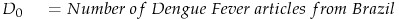
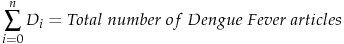
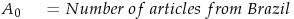
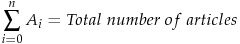
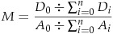
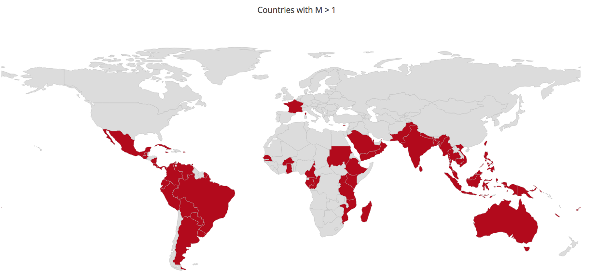

# Introduction 

This purpose of this project is to serve as a proof-of-concept demonstration for comparative analysis in determining how invested a country is in researching a specific disease.

In this example case, we will investigate Dengue Fever research in Brazil. 

It is not appropriate to simply compare the raw number of articles since wealthy countries (e.g. the United States and Japan) tend to produce more research on any given subject than their non-wealthy counterparts. Thus, we will use this metric **M** as defined below:

  
   
  
  



Where **M** stands for Multiple, which represents how much more research Brazil produces on Dengue Fever than expected.

For example, if we find that Brazil produces 5% of the world's research on Dengue Fever, but only 1% of the world's total research, then M = 5 and we would conclude that Dengue Fever research is of significant importance to Brazil.

Analysis will be performed on XML files fetched from PubMed.
# Challenges
Location is not necessarily easy to determine when mining scientific articles. The location of the journal where the article is published is not reliable - since prestigious journals receive submissions from all over the world. For example, The British Journal of Dermatology publishes many studies conducted in Japan and Korea - we cannot simply assign the locations of these studies as the "United Kingdom".

While attempts have been made to include a location ID for studies - this practice by PubMed only goes back to 2008. Using this "ELocationID" would give a NULL location for the vast majority of articles.

This project will use a simple mining technique based on author-disclosed affiliation information.

# Methods
## Scoring System
A weight of 1.0 will be assigned to each article, with the country of each disclosed author-affiliation given a weight of 1.0/N where N is the number of authors for that particular article that discloses their affiliation.

For example, if a study is carried out by 5 researchers: 2 affiliated with Taiwanese universities, 1 affiliated with a South Korean university, and 2 undisclosed. Then Taiwan will receive ~.66 points and South Korea will receive ~.33 points.

If a study has no disclosed affiliations, then the study will be ignored for the purpose of this analysis - for the reasons explained above in "Challenges" as to why the other available fields are unreliable.

## Finding the proper data to measure against
We must first search for a topic that should be of equal interest to all countries. If we are successful in finding such a topic, then said topic should have a distribution curve similar to that of the distribution curve from the aggregated total research output.

  * Infectious disease studies, specifically diseases caused by bacteria and viruses, must be ruled out as they tend to disproportionately affect developing countries.  
  * Toxicological studies must also be ruled out as there is great variation from country to country.  
  * Genetic disease studies must also be ruled out as some populations are more likely to succumb to certain genetic diseases than others.  

After much consideration, I simply settled on the term "Rat." Rats are one of the most commonly animals used in research and their use is limited by neither geography nor cost (unlike, for example, chimpanzees). Furthermore, researchers from all fields of medicine conduct research using rats. Thus, data on "Rat" should serve as a good candidate to measure Dengue Fever data against.

## Addressing potential PubMed bias  
* Since we will be working with PubMed data, it is important to assess whether there exists any bias in the articles available through PubMed. To account for this potential bias, we must perform analysis under two separate assumptions:  

* 1) PubMed has little to no bias. So we can simply compare Dengue Fever data from PubMed to the [SciMago] (http://www.scimagojr.com/countryrank.php?area=2700) data on all Medicine articles.

* 2) PubMed does have some inherent bias:  

  * 2a) We will compare PubMed Dengue Fever data to PubMed Rat Data. If some bias does exist, there is no reason to think that one subset of data is any more or less biased than another. Thus, comparing two samples from the same biased data will still allow us to gauge the relative **M** factor.

  * 2b) We will measure the bias of the PubMed data by weighing the PubMed Rat Data against the SciMago data. We will then assess the bias factor per country per year, and divide the Dengue Fever data by this bias factor. We then perform analysis of the "bias corrected" Dengue Fever data against the SciMago Data.  

We will use approach **2a** in this preliminary analysis, but all three approaches are covered in the [Comprehensive Analysis] (Analysis/Comprehensive_Analysis) folder.

# Analysis
1) XML files will be fetched from PubMed and placed in the **Data_Extraction/Pubmed_XML_files** folder.  
2) **Data_Extraction/data_extraction.py** will take analyze this XML files and convert them to python dict objects of the structure:  

```json
 dict = {"country1":  
                        {"year1":float,  
                        "year2":float}  
                        ...},  
         "country2":{...},  
        }  
  ```
and save them as .json files in the **Analysis/JSON_files** folder.  

The extraction process using this [Python string splitting method] (https://github.com/cbao/PubMed_Comparative_Analysis/blob/master/Data_Extraction/data_extract.py#L35) resulted in a net loss of ~16% of the data (65,552 of 409,797 articles) for the Pubmed Rat data and and approximately ~22% loss for the Pubmed Dengue Fever Data (2,173  of 10,092 articles).

This loss likely results from:  
* Articles with no disclosed affiliations.  
* Authors using lesser known names for their country.  
* Authors using unconventional formats when disclosing their affiliation.  

While this net loss may result in some distortion, we still retained approximately 80% of the original data from our two datasets, which should be sufficient for the purposes of this research. (80/20 splits are the convention in testing machine learning algorithms, so having 80% of the original data should still yield some very good insights.)

3) **Analysis/analysis.py** will analyze the json objects created by **Data_Extraction/data_extraction.py** and print the results.

# Results
The results for Dengue Fever research conducted by India for the years 2005 through 2015 are given below. The value next to the year is the ratio of Dengue Fever research done versus how much was expected for Dengue Fever for that given year.

**Comparison between India, Brazil, Germany, and Japan**  

|Year|	  India	   | Brazil      |Germany	      |Japan	       |
|:--:|:-----------:|:-----------:|:------------:|:------------:|
|2005|4.19879235461|3.67788012548|0.323426820697|0.172058963973|
|2006|4.09845365784|2.870575511|0.385823328794|0.249159503623|
|2007|2.28675545426|3.08097042972|0.332519633589|0.189641029006|
|2008|3.74110233886|3.03847362578|0.298973302062|0.350728344268|
|2009|2.27177451949|3.54762577931|0.377037426393|0.24586579415|
|2010|2.39562896863|2.16062859691|0.229031450681|0.282579084072|
|2011|2.23878967681|2.23999084944|0.42141024484|0.288593981776|
|2012|3.06705118962|2.35915044248|0.394994535987|0.334136251767|
|2013|2.52717556267|1.95306766158|0.364272869989|0.315957855914|
|2014|2.5793825404|2.26380511365|0.634520768679|0.332124960401|
|2015|3.14793507668|2.09246510766|0.530588237269|0.31295102915|

From this data, we can extrapolate that Dengue Fever is a very important topic of research to India and Brazil, but not a very important topic to Germany and Japan. This is expected as the Brazil and India are developing countries with climates that are hospitable to mosquitoes, while Germany and Japan are not.

While it may appear that the above countries are outliers selectively chosen to prove a point, the table below shows the top 20 countries ranked by how much total Dengue Fever research (between January 1st, 2005 and December 31st, 2015, inclusive) they disproportionately produce.

**Top countries sorted by M**

|Rank   |	  Country	      |    M	    |
|:-----:|:-------------:|:-------------:|
| 1 | Sri Lanka | 110.4 |
| 2 | Colombia | 57.09 |
| 3 | Indonesia | 40.06 |
| 4 | Cuba | 31.58 |
| 5 | Puerto Rico | 29.49 |
| 6 | Thailand | 21.35 |
| 7 | Singapore | 20.11 |
| 8 | Malaysia | 10.64 |
| 9 | Bangladesh | 8.800 |
| 10 | Venezuela | 8.787 |
| 11 | Pakistan | 8.452 |
| 12 | Ghana | 3.559 |
| 13 | India | 3.023 |
| 14 | Mexico | 2.580 |
| 15 | Brazil | 2.567 |
| 16 | Australia | 2.356 |
| 17 | Taiwan | 2.106 |
| 18 | Argentina | 1.919 |
| 19 | Saudi Arabia | 1.837 |
| 20 | France | 1.624 |


Looking at the Wikipedia article for [Dengue Fever Outbreaks] (https://en.wikipedia.org/wiki/Dengue_fever_outbreaks), we can see that our data fits the distribution map below quite well.


> Red: Epidemic dengue  
> Blue: Aedes aegypti (A mosquito that can spread dengue fever, chikungunya, Zika fever and yellow fever viruses, and other diseases.)



# Discussion
## Comments
This purpose of this project has been to serve as a demonstration of the value of comparative analysis in determining how invested a country might be in researching a specific disease. The analysis of Dengue Fever has produced results that one would expect from a disease of known mosquito-borne infectious nature.

## Looking ahead
The ultimate goal of this project is to analyze diseases that are of indeterminate origin. By studying patterns in geographic distribution, we can form hypotheses regarding the pathogenesis of disease. For example, if analysis on disease "XYZ" results in a pattern of non-contiguous developing countries producing significant amounts of research, then we would try to find the commonalities between the countries and conduct research to find the cause.

## Acknowledgements
Special thanks to [PubMed](https://www.pubmed.com) and [SciMago](https://scimagojr.com) for aggregating this data and making it publicly available.
